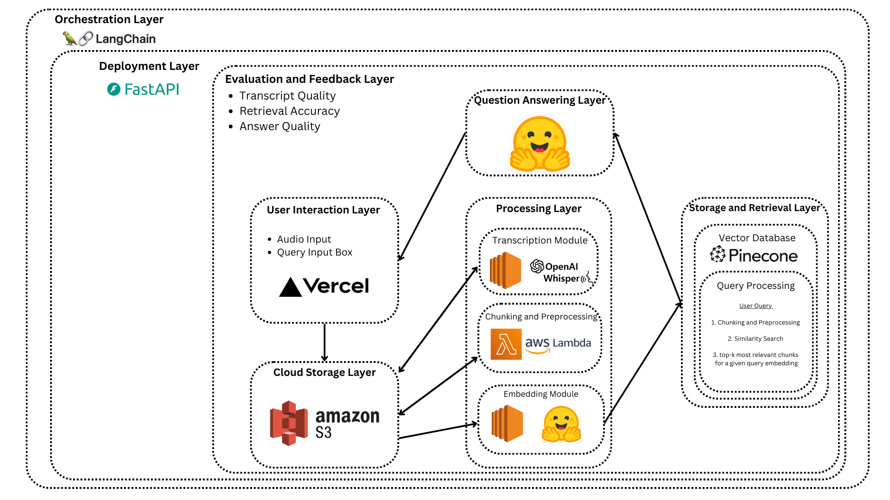

# Whispra

## 1. Project Brief 

 Whispara is a open-source, cloud-based, end-to-end Retrieval Augmented Generation pipline that leverages audio transcriptions to provide contextually accurate answers to user queries. It utilizes state-of-the-art machine learning techinques with scalable cloud tools to create an intelligent and efficient question-answering system. 

 ## 2. System Design Architecture 

 This image gives an overview of how this project is structures. 

 <!--  -->

 ## 3. What is in this repository? 

 ## Appendix

 ### A: Components and Tools/Services

 ## Components and Tools/Services

| Component              | Tool/Service                                       |
|------------------------|---------------------------------------------------|
| **Audio File Storage** | Amazon S3                                         |
| **Transcription**      | OpenAI Whisper      |
| **Text Embedding**     | Sentence Transformers (HuggingFace or ada-002)    |
| **Vector Database**    | Pinecone                                          |
| **Question Answering** | HuggingFace Pre-trained Model (e.g., T5, RoBERTa) |
| **Orchestration**      | LangChain                                         |
| **Backend**            | FastAPI                                  |
| **Frontend**           | Vercel                                            |
| **Cloud Hosting**      | AWS                                |

